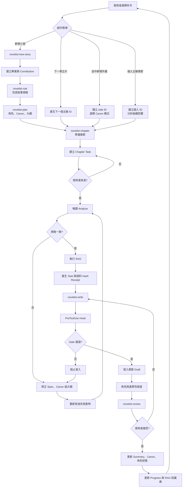
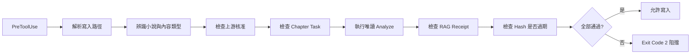

<div align="center">

# Novelist Skills

**把長篇小說當成可追蹤、可檢索、可審查的創作專案。**

Agent Plugins 1.0 · Strict SDD · Local RAG · Canon Lifecycle

</div>

Novelist Skills 是供 VS Code GitHub Copilot Agent 使用的小說創作插件。它將
GitHub Spec Kit 的規格驅動方法帶入長篇寫作：先定義規則與故事規格，再建立
大綱和章節任務；每次寫作前，從專案知識庫取回角色、世界觀、伏筆與最新進度。

所有狀態都保存在小說專案中，可閱讀、可版本控制，也不依賴聊天紀錄維持記憶。

## 特色

| 能力 | 帶來的效果 |
| --- | --- |
| 六個明確命令 | 每個創作階段都由使用者啟動，不猜測意圖、不跳步 |
| 嚴格 SDD Gate | 規格、canon、章節任務與 RAG receipt 過期時禁止寫正文 |
| 本機 RAG | 零外部依賴，優先檢索角色、進度與 canon，不上傳故事資料 |
| 語系感知檢索 | 支援繁中、簡中、日文、英文及專案詞彙別名 |
| 角色生命週期 | 追蹤角色個性、位置、存亡、離場與回歸條件 |
| 薄型 Skill | 只載入目前階段的短指令，不預讀其他 Skill 或共用文件 |
| 可替換的檢索層 | 保留穩定資料契約，未來可換成 embeddings 或混合檢索 |

## 快速開始

1. 在 VS Code 命令面板執行 `Chat: Install Plugin From Source`。
2. 輸入這個 Git 倉庫的 URL，並確認 `novelist-skills` 已啟用。
3. 在 Chat 依序執行下列命令；每一階段都會檢查上一階段的產物。

```text
/novelist-skills:novelist-new-story
/novelist-skills:novelist-rule
/novelist-skills:novelist-plan
/novelist-skills:novelist-chapter
/novelist-skills:novelist-write
/novelist-skills:novelist-review
```

建立小說時選擇內容語系：`zh-Hant`、`zh-Hans`、`ja` 或 `en`。之後每完成
一章，重複執行 `novelist-chapter` → `novelist-write` → `novelist-review`。

## 創作流程



目前 `0.7.0` 已實作一般章節流程與單一 Hook dispatcher。圖中的外篇、插入章
ID 與 `content_type` 分流是相容的擴充流程，尚未提供對應的 ID 產生器與驗證
規則；在完成實作前，請勿將它們視為已可用命令。

| Command | 工作 | 主要產物 |
| --- | --- | --- |
| `novelist-new-story` | 建立小說並核准治理規則 | `constitution.md`、語系設定 |
| `novelist-rule` | 訪談、釐清並核准故事規格 | `spec.md`、requirements checklist |
| `novelist-plan` | 建立角色、世界觀、伏筆與大綱 | `characters.json`、`canon/`、`outline/` |
| `novelist-chapter` | 規格化單章、分析依賴並執行 RAG | chapter task、RAG receipt |
| `novelist-write` | 通過 Gate 後撰寫單章 | chapter draft |
| `novelist-review` | 審查、接受並更新故事狀態 | summary、canon、progress |

每個命令都是獨立 Skill，且設定為 `disable-model-invocation: true`。Agent 不會
因為一句「我想寫小說」就自行啟動或跨越流程，創作控制權留在使用者手上。

### Context 與 Token

VS Code 會在每次明確呼叫 slash command 時載入該命令的 `SKILL.md`；Plugin
目前沒有可依專案檔案取消這次注入、或保證跨聊天快取的 API。因此本插件採用
可實際驗證的低 token 策略：

- `disable-model-invocation: true` 防止六個 Skill 被模型自動載入。
- 初始化時寫入版本化 `skill_context` marker。
- marker 相符時，命令只把自身當成階段提醒，不讀其他 `SKILL.md`，也不預讀
  `shared/novelist/references/`。
- 只有 CLI 檢查失敗且確實需要判讀時，才讀單一相關 reference。
- 測試限制每個 `SKILL.md` 小於 2,200 字元，避免日後不知不覺膨脹。

marker 表示「專案採用哪一版受 scripts 與 Hook 強制的流程」，不表示新聊天已
記住舊聊天內容。這樣即使換一個 Chat session，精簡命令仍可獨立、安全執行。

## 故事知識庫

RAG 會掃描已核准的規格、canon、大綱、章節摘要，以及三份高優先級狀態：

| 檔案 | 記錄內容 |
| --- | --- |
| `story.json` | 小說名稱、內容語系、主角 ID、目前章節、最新進度 |
| `characters.json` | 角色個性、別名、位置、存亡狀態、最後出場章與回歸條件 |
| `progress.json` | 最新接受章節、摘要、當前角色與章節歷史 |

目前檢索器使用 BM25 類似排名、Latin word token 與 CJK bigram，不需要向量
資料庫或 API。檢索結果會產生 receipt，綁定章節任務 hash、知識庫 hash 與
內容語系；任一項改變都必須重新檢索。

### 語系配置

每部小說的 `.novelist/config.json` 是檢索語系的唯一設定來源：

```json
{
  "schema_version": 1,
  "skill_context": {
    "protocol": "novelist-sdd",
    "version": 1
  },
  "content_locale": "zh-Hant",
  "retrieval": {
    "normalization": "NFKC",
    "tokenizer": "cjk-bigram",
    "stopwords": [],
    "term_aliases": {
      "玉佩": ["玉珮"],
      "計畫": ["計劃", "计划"]
    }
  }
}
```

| 設定 | 說明 |
| --- | --- |
| `skill_context` | 已安裝的精簡流程協定版本；不相符時停止執行 |
| `content_locale` | `zh-Hant`、`zh-Hans`、`ja` 或 `en` |
| `normalization` | `NFKC` 可統一全形字與 Unicode 相容形式；也可選 `NFC` |
| `tokenizer` | 中日文預設 `cjk-bigram`，英文預設 `word` |
| `stopwords` | 排除反覆出現、但對故事檢索沒有辨識力的詞 |
| `term_aliases` | 將角色稱呼、異體字、歷史拼法或繁簡詞彙映射到同一概念 |

插件不會假設繁簡詞彙能完整自動互換。把故事真正使用的異體詞放入
`term_aliases`，會比全域字形轉換更準確，也能避開一對多的語意誤判。

## 角色連續性

角色狀態可設為 `active`、`departed`、`missing` 或 `dead`。非 active 角色若
無預警出現在草稿，`check_continuity.py` 會阻擋該章。

有計畫的回歸需要兩次明確確認：

1. 審查草稿時以 `--allow-return <character-id>` 放行。
2. 接受章節時以 `--return <character-id>=<回歸理由>` 更新角色狀態。

因此「上一章已死亡的人突然站在門口」不再只是 Agent 記憶力問題，而是可被
檢查的專案狀態。

## 嚴格 SDD Gate

每個可核准產物都以 SHA-256 記錄在 `.novelist/approvals.json`。固定依賴為：

```text
constitution → specify → clarify/checklist → canon + outline
             → chapter task → analyze → RAG receipt → draft
             → review/update state
```

空模板不能核准；上游內容變更後，下游核准會失效。Copilot Plugin 另透過
`com.github.copilot/hooks/hooks.json` 的單一 `PreToolUse` dispatcher 攔截
不合規的寫入，並以 exit code 2 拒絕修改正文或受治理產物。

Hook 是 Copilot 客戶端的強制層。不支援 Hook 的 Agent 仍能使用可攜式 Skills，
但必須依靠工作流指令與 `sdd.py gate` 執行檢查。

Hook 內部固定沿著同一條檢查鏈執行：



外篇與插入章不需要額外 Hook。完成 `content_type` 擴充後，兩者會共用同一個
dispatcher，再依內容類型套用不同驗證規則。

## 專案結構

```text
novels/<story-slug>/
├── .novelist/
│   ├── approvals.json
│   ├── config.json
│   └── retrievals/
├── canon/
│   ├── characters.md
│   ├── setups.md
│   ├── timeline.md
│   └── world.md
├── chapters/
│   ├── drafts/
│   ├── summaries/
│   └── tasks/
├── checklists/
├── outline/
├── constitution.md
├── spec.md
├── story.json
├── characters.json
└── progress.json
```

## 本機 CLI

所有核心檢查都是 Python 3.11 標準函式庫工具，也能離開 Agent 單獨執行。

```powershell
# 建立繁中小說
python shared/novelist/scripts/init_novel.py my-story --title "故事名稱" --locale zh-Hant

# 查詢知識庫
python shared/novelist/scripts/retrieve.py novels/my-story "主角第一次見到戒指時知道什麼"

# 檢查角色連續性與專案完整性
python shared/novelist/scripts/check_continuity.py novels/my-story novels/my-story/chapters/drafts/01.md
python shared/novelist/scripts/validate_project.py novels/my-story

# 執行正文寫入前 Gate
python shared/novelist/scripts/sdd.py gate novels/my-story --task chapters/tasks/01.md

# 執行測試
python -m unittest discover -s tests -v
```

更完整的流程與檢索契約請見
[`sdd-workflow.md`](shared/novelist/references/sdd-workflow.md) 與
[`retrieval.md`](shared/novelist/references/retrieval.md)。

## 設計基礎

本插件採用 [GitHub Spec Kit](https://github.com/github/spec-kit) 的 SDD 階段與
核心原則：規格是意圖來源、constitution 是不可稀釋的治理準則、品質 checklist
由 reviewer 擁有、analyze 保持唯讀，且 implement 前必須通過 prerequisites。
小說領域在此之上加入 canon lifecycle、角色狀態與具語料 hash 的 RAG gate。